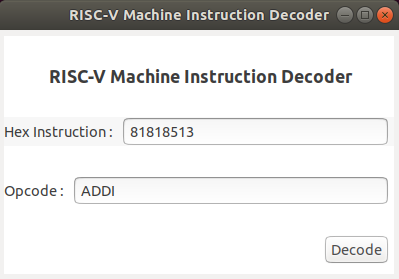

# RISC-V Instruction Decoder
Very simple RISC-V machine instruction decoder , written in python .Mainly aiming to understand how to decode RISC-V ISA . Currently only supports RV64IMAFD instructions only.

### Features
 - Supports RISC-V RV64IMAFD instructions.
 - Uses spec 2.2 .
 - Graphical user interface.

## Usage
```sh
$ python3 riscv-decode.py [-h] [-g] [instruction]

positional arguments:
  instruction    RISC-V Machine level instruction in hex

optional arguments:
  -h, --help     show this help message and exit
  -g, --graphic  enable GUI mode

```
## Example
```sh
$  python3 riscv-decode.py 81818513
RISC-V 2.2 RV64IMAFD Machine Instruction To Opcode Decoder 

Instruction : 0x 81818513
Opcode      :  ADDI
```

## Screenshots
```sh
$  python3 riscv-decode.py 81818513 -g
```
